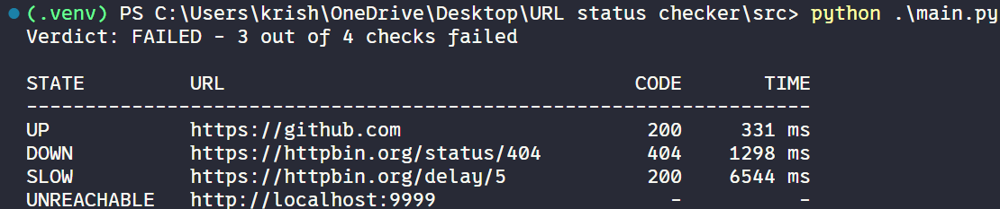
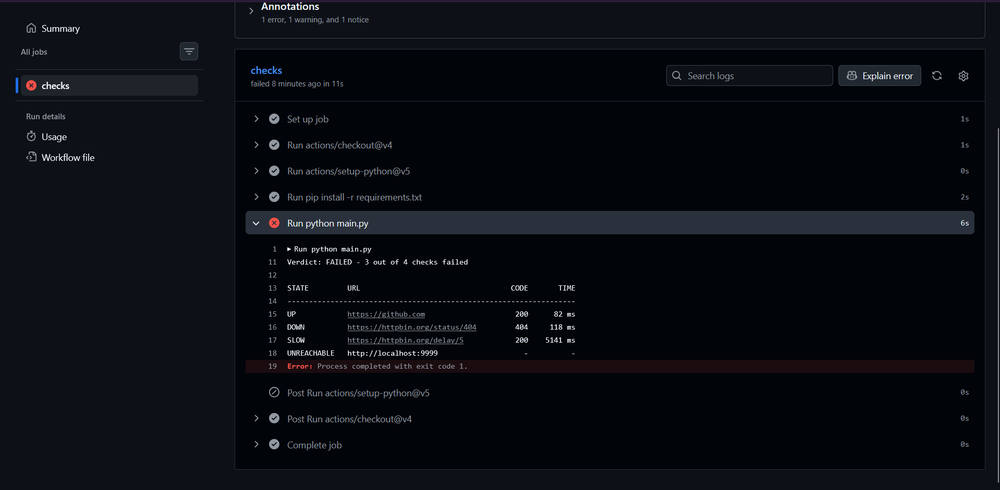

# URL Status Checker

A small command-line tool that checks if websites are healthy, built to run inside a CI/CD pipeline like GitHub Actions.

It runs once, prints a verdict, and exits with a pass/fail code. If a site is broken or too slow, the exit code fails the pipeline step, so it can block a deploy or tell you something went wrong after one.

It's not a long-running monitor. It checks, reports, and quits. That's the whole point.



---

## Why I built this

I wanted a simple "is my site actually up?" gate for my pipelines. Two ways I use it:

- **Pre-deploy:** start the app on localhost in CI, check it, and block the deploy if it's broken.
- **Post-deploy:** check the live URL after deploying, and fail loudly so I know to roll back.

To the tool, a URL is just a string, so localhost and public URLs work the same way.

---

## How it works

The tool is a straight pipeline. Data flows one way, then the program exits:

```
loader  →  runner  →  auditor  →  report  →  exit
```

| File | Job |
|---|---|
| `loader.py` | Reads `checks.yaml` and fills in defaults |
| `runner.py` | Visits each URL and records raw facts only (status code, time in ms) |
| `auditor.py` | Judges each result and labels it UP / DOWN / SLOW / UNREACHABLE |
| `report.py` | Prints the verdict headline and the results table |
| `main.py` | Runs everything in order and exits with 0 or 1 |

I kept the runner and the auditor separate on purpose. The runner only collects facts and never decides anything. When a result looks weird, I can print the runner's raw output and see right away whether it's a network problem or a logic problem.

### The four states

The auditor checks every result in this exact order and stops at the first match:

| Order | Check | State | Outcome |
|---|---|---|---|
| 1 | No response at all (timeout, refused, DNS fail) | `UNREACHABLE` | ❌ fail |
| 2 | Responded, but with the wrong status code | `DOWN` | ❌ fail |
| 3 | Took longer than the latency threshold | `SLOW` | ❌ fail |
| 4 | Everything's fine | `UP` | ✅ pass |

The order matters. You can't check a status code if nothing came back. A `500` still counts as a response, so it's `DOWN`, not `UNREACHABLE`.

**If any single check isn't UP, the whole run fails.**

---

## Setup

```bash
git clone https://github.com/Krishpatel-161-amt/url-status-checker.git
cd url-status-checker
pip install -r requirements.txt
```

Needs Python 3 and just two packages: `requests` and `PyYAML`.

---

## Config: `checks.yaml`

List the URLs you want checked under `checks:`.

```yaml
checks:
  - url: https://mysite.com
    expected_status: 200
    latency_threshold_ms: 500

  - url: http://localhost:8080/health    # uses defaults
```

| Field | Required? | Default |
|---|---|---|
| `url` | yes | none |
| `expected_status` | no | `200` |
| `latency_threshold_ms` | no | no latency check (status only) |

---

## Usage

Run it from inside `src/`:

```bash
cd src
python main.py                        # uses checks.yaml
python main.py --config other.yaml    # use a different config file
python main.py --help
```

Example output:

```
Verdict: FAILED - 3 out of 4 checks failed

STATE         URL                                   CODE       TIME
-------------------------------------------------------------------
UP            https://github.com                     200      82 ms
DOWN          https://httpbin.org/status/404         404     118 ms
SLOW          https://httpbin.org/delay/5            200    5141 ms
UNREACHABLE   http://localhost:9999                    -          -
```

The verdict goes on top so you can see the result straight away when you're skimming a long CI log.

### Exit codes

| Code | Meaning |
|---|---|
| `0` | All checks passed (all UP) |
| `1` | At least one check failed |

This is what GitHub Actions reads to decide if the step passes or fails.

---

## GitHub Actions

The workflow in `.github/workflows/url-check.yml` runs on every push. It installs the dependencies and runs the tool. If any check fails, the exit code turns the build red.



---

## Known limitations

These are on purpose for v1:

- **A 200 on a broken page still passes.** The tool checks if a site is reachable, not if the content is correct.
- **No retries.** One check, one verdict. If a URL has a hiccup, it fails.
- **Checks run one at a time.** That's fine for a handful of URLs.
- **Very slow counts as UNREACHABLE.** If a site doesn't answer before the timeout, there's no response to measure.

## Ideas for v2

- Fail with an error if `checks.yaml` has no checks (right now an empty list passes)
- Catch typo'd URLs (like a missing `https://`) in the loader instead of reporting them as UNREACHABLE
- Show *why* a URL was unreachable (timeout vs refused vs DNS)
- Optional "page must contain X" check
- Retries and parallel checks
